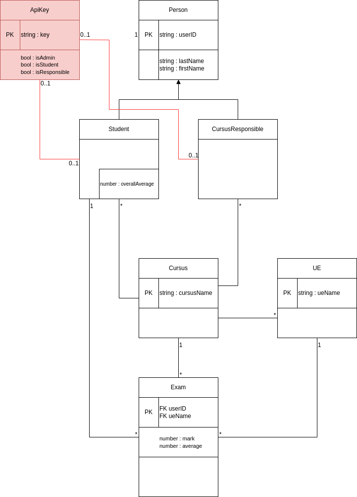

# Authentification
On veut protéger l'API :
- Etudiant
  - Peuvent seulement lire (GET) les endpoints
    - /students/:idStudent 
      - Il faut vérifier que *idStudent* correspond bien à la personne qui fait la requête sur l'API
    - /cursus/:idCursus/ue/:idUe/exam/:idStudent
      -Il faut vérifier que *idStudent* est bien inscrit dans le cursus et que *idStudent* correspond bien à la personne qui fait la requête sur l'API
- Cursus Responsible
  - Peuvent éditer (GET, POST, PATCH, DELETE) dont ils sont responsables (Cursus, Ue et Exams)

## Stratégie d'authentification
Pour mettre en place l'authentification, on va se servir d'une clé API à insérer dans le header des requêtes sur l'API qui servira à identifier de qui provient la requête.

Pour cela on crée la nouvelle entité **ApiKey**, qui représente une clé unique d'accès à l'API, elle contient les rôles d'un utilisateur et est lié à son utilisateur (pour réccupérer ses informations à partir de la clé)



**Dans un premier temps ajouter cette entité**
- Pas la peine de coder un controller : on n'a pas besoin d'endpoint
- On s'occupera de créer le service plus tard

## Ajout de la clé API
Il faut qu'on génère les clés API à la création des utilisateurs, en fonction de son type (pour lui assigner ses roles). On va donc modifier les fonctions create des services des entitiés Students et CursusResponsible pour les utilisateur à leur clé API dès leur création.

Un peu de la même manière que pour la génération des ID (même type de boucle), on va générer une clé api unique en utilisant la fonction [crypto.randomUUID()](https://developer.mozilla.org/en-US/docs/Web/API/Crypto/randomUUID). Pour cela il faudra vérifier si la clé est utilisée ou non, donc il faut d'abord **implémenter une fonction qui renvoi true si la clé est déjà utilisée** dans l'ApiKeyService.

```Typescript
async isApiKeyAlreadyUsed(key: string) {
    const apiKey = await this.apiKeyRepository.findOne({ apiKey: key })
    
    if(apiKey === null) {
      return false;
    }
    return true;
  }
```


On va utiliser cette fonction pour générer la bonne clé à la création d'un utilisateur. On a ajouté un champs apiKey dans les entités Student, et CursusResponsible. Dans les fonctions create associées, il faut donc les initialiser.

```Typescript
async create(createStudentDto: CreateStudentDto) {
    const student = new Student();

    ...

    const apiKey = new ApiKey();

    let uuid = crypto.randomUUID();
    while (await this.apiKeyService.isApiKeyAlreadyUsed(uuid)) {
      console.log('looping ?');
      uuid = crypto.randomUUID();
    }
    apiKey.apiKey = uuid;
    apiKey.isAdmin = false;
    apiKey.isResponsible = false;
    apiKey.isStudent = true;
    apiKey.student = student;
    apiKey.cursusResponsible = null;

    await this.em.persistAndFlush(student);

    return student;
  }
  ```

  A ce stade on a ajouter la notion de clé API à l'application, maintenant il faut la mettre à contribution. 


# Admin
On veut créer un utilisateur admin quand l'application démarre pour la première fois, sinon on sera bloqué.

Pour créer ce genre de comportement on utilise l'interface [onModuleInit](https://docs.nestjs.com/fundamentals/lifecycle-events#lifecycle-events-1) qui permet de lancer une fonction quand le module d'un service est instancié par NestJs.

On va implémenter cette interface dans le ApiKeyService.


On implémente l'interface
```Typescript
export class ApiKeyService implements OnModuleInit { ... }
```

On ajoute la fonction de l'interface à l'ApiKeyServicec qui sera déclenchée à l'instanciation de l'ApiKeyModule. Dans cette fonction on va créer un Student factice auquel on assigne le role Admin et une clé API 
```Typescript
@UseRequestContext()
  async onModuleInit() {
    try {
      const student = await this.studentsService.findOne('admin');
    } catch (error) {
      const stud = await this.studentsService.create({
        firstName: 'admin',
        lastName: 'admin',
      });

      let uuid = crypto.randomUUID();
      while (await this.isApiKeyAlreadyUsed(uuid)) {
        console.log('looping ?');
        uuid = crypto.randomUUID();
      }
      const apiKey = new ApiKey();
      apiKey.apiKey = uuid;
      apiKey.isAdmin = true;
      stud.apiKey = apiKey;
      stud.userID = 'admin';
      await this.em.persistAndFlush(stud);
      console.log('Admin API Key : ' + uuid);
    }
  }
```

  # Guard
Pour protéger une route on utilise des [Guards NestJs](https://docs.nestjs.com/guards#guards).

Une Guard est une classe qui implémente l'interface CanActivate ([doc](https://docs.nestjs.com/guards#authorization-guard)). Cette interface expose une fonction qui prend en paramètre la requête HTTP que doit contrôler la Guard et qui renvoie true si la requête est autorisée, sinon false.

```Typescript
import { Injectable, CanActivate, ExecutionContext } from '@nestjs/common';
import { Request } from 'express';


@Injectable()
export class AuthGuard implements CanActivate {
  canActivate(
    context: ExecutionContext,
  ): boolean | Promise<boolean> {
    const request: Request = context.switchToHttp().getRequest();
    
    
    return true;
  }
}
```

**A vous de créer la Guard** dans /shared/auth.guard.ts

## Utilisation d'une Guard
[On peut utiliser les Guard à plusieurs niveau](https://docs.nestjs.com/guards#binding-guards) en utilisant le décorateur **@UseGuard()** :

- Pour protéger des endpoints individuellement :
  - ```Typescript
    @Controller()
    export class AppController {
      @Get()
      @UseGuards(AuthGuard)
      getHello(): string {
        return 'Hello world';
      }
    } 
    ```

- Pour protéger tous les endpoints d'un controller :
  - ```Typescript
    @Controller()
    @UseGuards(AuthGuard)
    export class AppController {
      @Get()
      getHello(): string {
        return 'Hello world';
      }
    } 
    ```

- Pour protéger tous les endpoints de l'application :
  - Pour cela dans le app module on inscrit la guard qui s'appliquera globalement
  - ```Typescript
      @Module({
      
      ...,

      providers: [
        
        ...,

        { provide: APP_GUARD, useClass: AuthGuard },

        ...
      ],
    })
    export class AppModule {}
    ``` 

En ce qui nous concernne on va opter pour la protection de toute l'application : **A vous de jouer**

## ApiKey et Guard
Pour utiliser les ApiKey qu'on a ajouté à l'application, on veut utiliser son service qu'on peut injecter dans la Guard.

Tout d'abord on va oberver quelles données on peut observer dans une requête entrante

**Ajouter les lignes suivantes dans la Guard**

```Typescript
    console.log('HEADER :', request.headers);
    console.log();
    console.log('PARAMS :', request.params);
    console.log();
    console.log('PATH :', request.path);
    console.log();
    console.log('METHOD :', request.method);
```

**Puis faire une requête** sur un endpoint avec paramètre sur la route et en ajoutant un paramètre dans le header et **Observer le résultat sur la console de l'API**

Depuis le header on peut obtenir une clé que l'utilisateur fournit à partir de laquelle on peut retrouver l'entity ApiKey et depuis cette dernière on peut retrouver notre entité Student ou Cursus Manager. (On fait une **injection pour utiliser le ApiKeyService** dans lequel se trouve une fonction **findOne** qui prend en paramètre la clé api)

Si on ne trouve pas les informations voulue, alors on throw une ForbiddenException

Par exemple, si la clé api n'est pas fournie, alors on rejette la requête :

```Typescript
if (!request.headers['api-key']) {
      throw new ForbiddenException('Api Key required');
}
```

