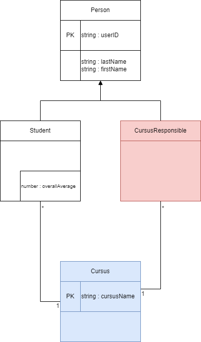

# Nouvelle étape, nouvel objectif
On veut ajouter les cursus à l'application

## CursusResponsible
De le même manière que pour les Student, on ajoute la nouvelle entité **CursusResponsible** et son endpoint 