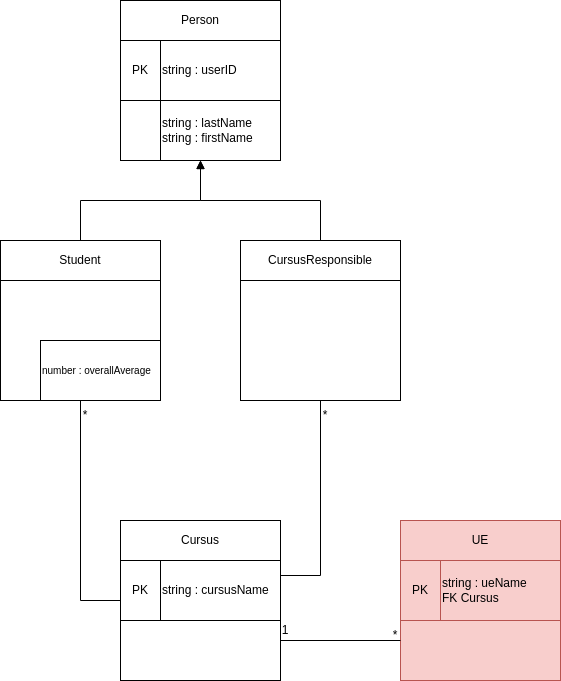
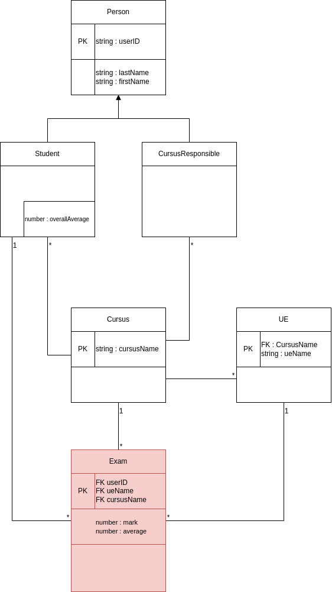

# Etape suivante, Imbrication : routing plus complexe et clé primaire composite
On veut ajouter à l'application la notion d'UE qui sont propre à un Cursus (Owner).



## Ajouter l'entité
La méthode ne change pas grandement par rapport à ce qu'on a déjà fait. La seule différence réside dans la gestion de **clé primaire de UE** qui est **composée du Cursus** auquel il appartient **et de son nom**.

**HEUREUSEMENT** [MikroORM documente](https://mikro-orm.io/docs/composite-keys#use-case-1-dynamic-attributes) bien la gestion des clé primaire composite et des clé étrangère comme clé primaire.

#### Dans un premier temps
Ajouter la nouvelle entité comme on sait le faire (càd le fichier .entity.ts. On ne touche pas au service et on peut d'ores et déjà supprimer  fichier du controller).

On s'occupe du problème de a la clé primaire composite juste ensuite.

#### Temps n°2 : Clé primaire composite, on y vient
On se réfère à la [documentation de MikroORM](https://mikro-orm.io/docs/composite-keys#use-case-1-dynamic-attributes)

1. Dans le champs cursus de l'entité UE qu'on a ajouté pour modéliser la relation entre UE et Cursus, on ajoute le paramètre suivant **{primary: true}** pour obtenir
    ```Typescript
    @ManyToOne()
    cursus: Cursus;
    ```

2. On ajoute la ligne suivant
    ```Typescript
    [PrimaryKeyType]?: [string, string];
    ```

    - La partie *[PrimaryKeyType]?* est nécessaire c'est MikroORM qui impose ça
    - La partie de droite, le tableau c'est le type de la clé primaires (clé primaire de cursus => string + la demie clé primaire de UE => string )

## Ajouter un controller
Pour rappelle on veut imbriquer l'endpoint des UEs dans celui des Cursus
| Route                                          | POST | GET | PATCH | DELETE | Accès         |
|------------------------------------------------|------|-----|-------|--------|---------------|
| /cursus/:cursusName/ue                         | ✓    | ✓   |       |        | Responsible   |
| /cursus/:cursusName/ue/:ueName                 |      | ✓   |✓      |✓       | Responsible   |

On va donc ajouter un nouveau controller dans le module Cursus : 
1. Supprimer le controller de la resource ue qu'on vient de créer (Supprimer le fichier, et  supprimer toute notion dans le Ue Module)
2. Créer le fichier */src/cursus/controllers/ue.controller.ts*
3. Inscire ce nouveau controller dans le Cursus Module
    <details>

    ```Typescript
    @Module({
    ...,
    controllers: [CursusController, UeController],
    ...
    })
    export class CursusModule {}
    ```
    </details>
4. Déplacer le fichier */src/cursus/cursus.controller.ts* dans le dossier */src/cursus/controllers/*
5. On déclare dans le fichier */src/cursus/controllers/ue.controller.ts* un nouveau controller dont le chemin est *cursus/:cursusName/ue*, on aura alors 
    <details>
    On devrait obtenir la classe suivante :

    ```Typescript
    @Controller('cursus/:cursusName/ue')
    export class UeController {
        ...
    }
    ```
    </details>
4. Enfin, on complète le controller avec les endpoints du CRUD (findall, find, create, update) (fonctions avec les décorateur HTTP @GET, @POST, @PATCH, @ÐELETE)
    - A l'intérieur des controller on utilisera le service et les DTOs de l'entité imbriquée (ici, UeService, CreateUeDto et UpdateUeDto)
    - **Attention** On a inséré un paramètre sur le chemin du controller, donc il faut bien veiller à le récupérer en paramètre des différents endpoints !!!

## Modifier le service, adapter le service
1. On utilise des clé primaires composite, donc dans les fonctions qui en ont besoin, il faut lui ajouter la (les) clé manquante.
    <details>
    Il faut le faire dans toutes les fonctions en fait ;)

    Par exemple :
    ```Typescript
    // Fonctions du service
    async findOne(cursusName: string, ueName: string) { ... }
    async update(cursusName: string, ueName: string, updateUeDto: UpdateUeDto) { ... }
    async remove(cursusName: string, ueName: string) { ... }

    //Dans l'utilisation du repository
    await this.ueRepository.findOneOrFail({
      ueName: ueName,
      cursus: cursus,
    });

    ```
    </details>


# A vous
On a fait le tour des clé composites. Maintenant c'est  à vous de jouer, on va ajouter l'entité **Exam**

On surrencherit : on aura non pas 2 mais **3** clés étrangère comme clé primaire

On attribue un **Exam** (une note) à un **Student** pour une **UE** de son **Cursus**

On aurait les endpoints suivants :

| Route                                          | POST | GET | PATCH | DELETE | Accès         |
|------------------------------------------------|------|-----|-------|--------|---------------|
| /cursus/:cursusName/ue/:ueName/exams           | ✓    | ✓   |       |        | Responsible   |
| /cursus/:cursusName/ue/:ueName/exams/:idStudent|      | ✓   |✓      |✓       | Responsible   |

## Remarques
- Le createDto doit contenir :
    - mark, un nombre compris entre 0 et 20
    - studentId, une chaine de caractère
- On ne veut que pouvoir modifier la note lors de l'update d'un Exam

**A vous de jouer maintenant !**

# Des nouveaux trucs !

## Serialization
Pour le moment, les réponses de l'API sont un peu longue, ceci est dû aux différents *populate = true* nécessaire pour ne pas avoir à gérer des problèmes de chargemet d'entités surtout quand on commence à toucher aux relations.

Pour y remédier, on va transformer la façon dont les entités sont "affichée"/mis en série/serialize. Pour ce faire, on utilise le [serializer de MikroORM](https://mikro-orm.io/docs/serializing#property-serializers).

Les serializer s'utilisent aux niveau des entités, en paramètres des décorateur @PrimaryKey, @Property ou décorateur de relation.

un serializer se présente et s'utilise sous la forme suivante
```Typescript
@Decorateur({ ..., serializer: value => value.name, ... })
machinChouette: valueType;
```

Ou
```Typescript
@Decorateur({ ..., 
    serializer(value: valueType) {
      return value.name;
    }, 
    ... })
machinChouette: valueType;
```
Ou encore
```Typescript
@ManyToOne({
    ...,
    serializer: (value: valueType) => value.name,
    ...
  })
machinChouette: valueType;
```


La fonction serializer doit retourner ce que l'API doit afficher.oit une valeur primitive (type string, number, boolean, ...), soit un objet.

**Attention** à bien prendre en compte le cas où la valeur peut être nulle.

## A vous !
Pour les champs représentant une relation, modifier l'affichage de l'entité liée.

**Attention** à traiter les collections correctement ;)

Serializers à ajouter :
- Cursus
    - Collection student
    - Collection responsable
- Ue
    - Collection Exam
    - Cursus
- CursusResponsible
    - Cursus
- Exam
    - Cursus
    - Ue
    - Student
- Student
    -Cursus

C'est quand bien plus propre n'est-ce pas !

## Propriétés vituelles
On utilise les propriétés virtuelle pour exposer une donnée calculée en fonction des données de l'entité à laquelle on ajout cette propriété virtuelle. Un exemple serait peut-être plus parlant

Soit l'entité suivante

```Typescript
@Entity()
export class User {
  @Property()
  firstName!: string;

  @Property()
  lastName!: string;
}
```

On veut créer exposé la nouvelle donnée *"fullName"*, la concaténation du nom et du prénom qui sont enregistré dans la base de données sans pour autant enregistrer le contenue de *fullName* en base de donnée. Alors, on ajoute un getter (Une fonction avec *get* devant) qui retourne la donnée souhaitée. On décore cette fonction avec @Property auquel on passe en paramètre "{persit: true}"

On obtiendrait alors
```Typescript
@Entity()
export class User {
  @Property()
  firstName!: string;

  @Property()
  lastName!: string;

  @Property({ persist: false })
  get fullName() {
    return `${this.firstName} ${this.lastName}`;
  }
}
```

Cette fonctionnalité nous est utile pour calculer
- la moyenne d'un examen (Dans l'entité Exam)
- la moyenne d'un étudiant (Dans l'entité Student)

Comment faire 

### 1 - Ajouter des bi-directions

Dans notre cas, il va nous falloir ajouter quelques relations bi-directionnels pour effectuer ce calcul (Càd ajouter quelques @OneToMany) 
- Il faut pouvoir accéder depuis l'entité Ue à tous ses Exams
- Depuis l'entité Student, il faut accéder à tous ses Exams

<details>
J'ai ajouté la bi-direction dans l'entité Student pour avoir toutes ses notes : 

```Typescript
@OneToMany(() => Exam, (exam) => exam.student, {
    serializer(value: Collection<Exam>) {
      return value.getItems().map((exam) => {
        return { average: exam.average, mark: exam.mark, ue: exam.ue.ueName };
      });
    },
  })
  exams = new Collection<Exam>(this);
  ```
</details>

### 2 - Ajouter les propriétés virtuelles
<details>
J'ai ajouté la propriété virtuelle pour la moyenne globale d'un student

```Typescript
@Property({ persist: false })
  get globalAverage() {
    if (this.exams.length !== 0) {
      return (
        this.exams
          .getItems()
          .map((exam) => exam.mark)
          .reduce((partialSum, a) => partialSum + a, 0) / this.exams.length
      );
    }
    return -1;
  }
  ```
</details>