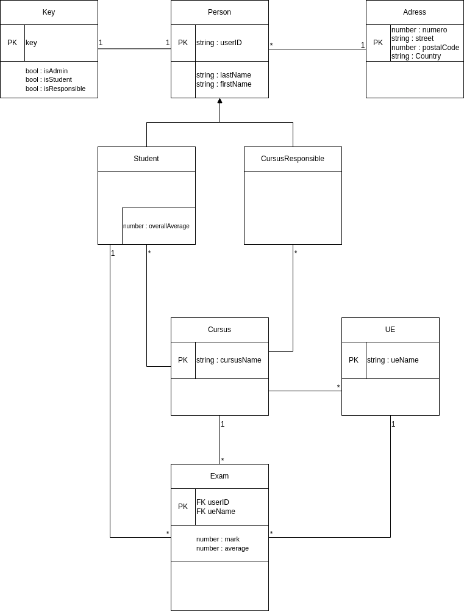
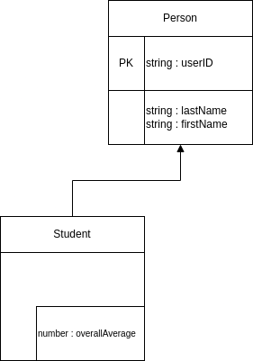

# Apprentissage par la pratique
On va réaliser une API pour permettant de gérer les notes de promotions d'étudiants



- Les différents cursus ont des responsables et des étudiants
- Les Cursus ont des examens
- Les examens ont une UE et un étudiant


| Route                                          | POST | GET | PATCH | DELETE | Accès         |
|------------------------------------------------|------|-----|-------|--------|---------------|
| /students                                      | ✓    | ✓   |       |        | Admin         |
| /students/:userID                              |      | ✓   |       |        | Student/Admin |
| /students/:userID/exams                        |      | ✓   |       |        | Students      |
| /students/:userID/exams/:ueName                |      | ✓   |       |        | Students      |
| /responsibles                                  | ✓    | ✓   |       |        | Admin         |
| /responsibles/:userID                          |      | ✓   |✓      |✓       | Admin         |
| /cursus                                        | ✓    | ✓   |       |        | Responsible   |
| /cursus/:cursusName/ue                         | ✓    | ✓   |       |        | Responsible   |
| /cursus/:cursusName/ue/:ueName                 |      | ✓   |✓      |✓       | Responsible   |
| /cursus/:cursusName/ue/:ueName/exams           | ✓    | ✓   |       |        | Responsible   |
| /cursus/:cursusName/ue/:ueName/exams/:userID   |      | ✓   |✓      |✓       | Responsible   |

# ORM
Object-relational mapping, librairie pour pour faire le lien entre des objets et une base de donnée.

On utilise un ORM pour communiquer avec une base de donnée PostgreSQL.


On utilise l'ORM MirkoORM (https://mikro-orm.io/)

## Installation dans NestJS

1. Créer le fichier ```docker-compose.yaml``` à la racine du projet :
```yaml
services:
  db:
    image: postgres:alpine
    environment:
      POSTGRES_PASSWORD: example
      POSTGRES_DB: nodeUsmApi
    ports:
      - "5432:5432"
```
2. Démarrer le container : ```docker compose up```

### Base donnée

### Importer la librairie
```properties
npm i @mikro-orm/core @mikro-orm/nestjs @mikro-orm/postgresql @mikro-orm/reflection
```

### Ajouter le fichier de configuration de MikroORM
Créer le fichier de configuration `mikro-orm.config.ts` à la racine du code source (dans le dossier /src)

```Typescript
import * as path from 'path';
import { defineConfig } from '@mikro-orm/postgresql';
import { TsMorphMetadataProvider } from '@mikro-orm/reflection';

export default defineConfig({
  host: 'localhost',
  port: 5432,
  user: 'postgres',
  password: 'password',
  dbName: 'demoDB',
  entities: ['dist/**/*.entity.js'],
  entitiesTs: ['src/**/*.entity.ts'],
  metadataProvider: TsMorphMetadataProvider,
  migrations: {
    path: path.join(__dirname, './migrations'),
    glob: '!(*.d).{js,ts}',
  },
  validate: true,
  debug: false,
});
```

###


### Configurer la librairie dans l'AppModule
Dans le fichier de configuration de l'AppModule : 
```Typescript
@Module({
  imports: [
    MikroOrmModule.forRoot(), // MikroORM trouvera le fichier de configuration 
  ],
  ...
})
export class AppModule {}
```

# Première Entité
On va d'abord se concentrer sur l'entité Student




## *Person* : Entité Abstraite 

C'est une entité utilitaire qu'on va utiliser pour faire un peu moins de duplication de code

1. Créer le dossier /src/shared/entities
2. Créer le fichier /src/shared/entities/person.entity.ts

Dans ce fichier on veut décrire l'entité abstraite Person.

Pour [déclarer une entité MikroORM](https://mikro-orm.io/docs/defining-entities), on déclare une classe décorrée par **@Entity()**. Ici, on veut déclarer une entité particulière, on lui ajoute le paramètre suivant pour obtenir le décorateur @Entity(**{ abstract: true }**) (https://mikro-orm.io/docs/defining-entities#using-custom-base-entity).

Dans les champs de classe, on définit les différentes propritétés des tables (userID, lastNamen firstName) qu'on décort soit par **@PrimaryKey()** quand il s'agit d'une clé primaire, soit par **@Propetry()**.

Pour préciser qu'un champs ne peut pas être null, on lui ajoute un point d'exlacamtion à la fin de son nom.

De la même manière, si on veut préciser qu'un champs peut être null, on lui ajoute un point d'interrogation.


Exemple :
```Typescript
@Entity()
export class Book {

  @PrimaryKey()
  id!: string;

  @Property()
  author!: string;

  @Property()
  publisher?: string;
}
```
<h3>A vous de jouer : Créez l'entité abstraite **Person**  <h3>

## *Student* : une vraie Entité
1. On veut l'API gère l'entité Student, donc on dit à NestJS de nous créer les fichiers pour coder cette ressource :
    ```properties
    nest generate resource students
    ```
    ou
    ```properties
    nest g res students
    ```

2. Déclarer la nouvelle entité
    ```Typescript
    @Entity()
    export class Student extends Person {}
    ```
<h3>Vérifiez que l'application démarre bien sinon vous avez mal fait quelque chose<h3>

## Création d'un *Student* : Endpoint POST

### Dto : Data transfert object

Pour créer un student, on a besoin de son nom et de son prénom qu'on obtiendra dans le **body** des requête post sur l'endpoint /students.

Si on ouvre le controller des students, on a quasiment rien à faire :
- Le Controller est déclaré (Décorateur *@Controller('students')*)
- Fonction pour la méthode POST déjà implémentée :
    ```Typescript
    @Post()
    create(@Body() createStudentDto: CreateStudentDto) {
        return this.studentsService.create(createStudentDto);
    }
    ```
Par contre il faut faut détailler quels données transits dans les **body** des requêtes. C'est à ça que servent les Dto.

#### Configuration de l'auto validation
1. Installer les dépendances `npm install class-validator class-transformer`
2. Modifier le lancement de l'application dans `main.js` pour activer le ValidationPipe (L'utilitaire qui va interceptée les exceptions des validations et les transformer en erreur HTTP) sur l'application en globalité
    ```Typescript
    async function bootstrap() {
        const app = await NestFactory.create(AppModule);
        app.useGlobalPipes(new ValidationPipe());
        await app.listen(3000);
        }
    bootstrap();
    ```
#### Déclaration d'un Dto
On déclare dans les champs d'un Dto le format des body de création d'une entités.
<details>

Pour l'entité Student ça serait
```Typescript
export class CreateStudentDto {
  lastname: string;
  firstname: string;
}
```
</details>


On utilise [les décorateurs de la librairie class-validator](https://github.com/typestack/class-validator#validation-decorators) pour ajouter les contraintes qu'on veut appliquer sur les champs du body.

<h3>A votre tour : </h3>

Custom le CreateStudentDto pour que dans le body **soit présent** les 2 **string** *firstName* et *lastName*.


