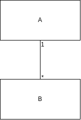
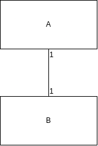

# Nouvelle étape, nouvel objectif
On veut ajouter les cursus à l'application

## CursusResponsible
De le même manière que pour les Student, on ajoute la nouvelle entité **CursusResponsible** et son endpoint

## Modification mais c'est de ma faute
MikroORM throw des erreurs que NestJS ne sait pas prendre en charge (NotFound et PrimaryKey).
Pour ne pas être obligé de faire des try/catch à chaque fois qu'on utilise des fonctions de MikroORM qui peuvent throw des erreurs, on va utiliser des [ExceptionsFilter](https://docs.nestjs.com/exception-filters) pour *transformer des erreurs non prises non compatibel en exception prise en charge par NestJS*

Je ne vois pas l'intérêt de recoder ce que j'ai déjà fait pour gérer les exceptions de MikroORM.

1.On créer les fichiers suivants :
- *src/shared/exception-filters/not-found.exception-filter.ts*
    ```Typescript
    import { NotFoundError } from '@mikro-orm/core';
    import {
    ArgumentsHost,
    Catch,
    ExceptionFilter,
    HttpStatus,
    } from '@nestjs/common';
    import { Response } from 'express';

    @Catch(NotFoundError)
    export class NotFoundErrorExceptionFilter implements ExceptionFilter {
    catch(exception: NotFoundError, host: ArgumentsHost) {
        const ctx = host.switchToHttp();
        const response = ctx.getResponse<Response>();
        const status = HttpStatus.NOT_FOUND;

        const filter = exception.message.match(/{(.*?)}/)[0];
        const ressource = exception.message.split(' ', 1)[0];

        response.status(status).json({
        statusCode: status,
        message: ressource + ',identified by ' + filter + ', not found',
        error: ressource + ' not found',
        });
    }
    }
    ```
- *unique-constraint-violation.exception-filter.ts*
    ```Typescript
    import { UniqueConstraintViolationException } from '@mikro-orm/core';
    import {
    ArgumentsHost,
    Catch,
    ExceptionFilter,
    HttpException,
    HttpStatus,
    } from '@nestjs/common';
    import { Response } from 'express';

    @Catch(UniqueConstraintViolationException)
    export class UniqueConstraintViolationExceptionFilter
    implements ExceptionFilter
    {
    regex = /("(.*?)"|'(.*?)')/gm;

    catch(exception: HttpException, host: ArgumentsHost) {
        const ctx = host.switchToHttp();
        const response = ctx.getResponse<Response>();
        const status = HttpStatus.CONFLICT;

        const keysValues = this.extractDuplicatedKeyValue(exception);

        const ressourceName = this.cleanParenthesisAndQuotes(
        exception.message.match(/"(.*?)"/)[0],
        );

        response.status(status).json({
        statusCode: status,
        message:
            'Duplicated key (' +
            keysValues.keys +
            ') with values (' +
            keysValues.values +
            ") for the ressource '" +
            ressourceName +
            "' ",
        error: 'Conflict, duplicated key',
        });
    }

    private cleanParenthesisAndQuotes(str: string) {
        return str
        .match(/("(.*?)"|'(.*?)')/gm)
        .map((value) => value.replace(/"/g, "'").replace(/'/g, ''));
    }

    private extractDuplicatedKeyValue(
        uniqueConstraintException: UniqueConstraintViolationException,
    ): KeysValues {
        if (uniqueConstraintException.message.includes('(')) {
        const matches = uniqueConstraintException.message.match(/\((.*?)\)/gm);
        const keys = this.cleanParenthesisAndQuotes(matches[0]);
        const values = this.cleanParenthesisAndQuotes(matches[1]);
        return { keys: keys, values: values } as KeysValues;
        } else {
        console.log(uniqueConstraintException.message);
        const matches1 = uniqueConstraintException.message.match(/"(.*?)"/gm);
        const matches2 = uniqueConstraintException.message.match(/'(.*?)'/gm);
        const keys = this.cleanParenthesisAndQuotes(matches1[1]);
        const values = this.cleanParenthesisAndQuotes(matches2[0]);
        return { keys: keys, values: values } as KeysValues;
        }
    }
    }

    export type KeysValues = {
    keys: [string];
    values: [string];
    };
        
    ```

2. Préciser à NestJs qu'on utilise les filters exceptions ci-dessus dans l'AppModule:
    ```TypeScript
    ...
    providers: [
        ...,
        { provide: APP_FILTER, useClass: UniqueConstraintViolationExceptionFilter },
        { provide: APP_FILTER, useClass: NotFoundErrorExceptionFilter },
        ...
    ],
    ...
    ```
3. Supprimer les try catch qu'on a ajouté (Dans les fonctions findOne des services)
## Cursus
### Description d'un Cursus
- A pour clé primaire son nom
- **Contient une liste d'étudiant**
- **Contient une liste de responsable**

**Comment Modéliser des relations entre entités ??**
### Modéliser des Relations
Il faut se référer à la [documentation de MikroOrm](https://mikro-orm.io/docs/relationships).

On compte 4 Type de relations :
- En se plaçant dans du point de vue de l'entité **A**, on a donc affaire à une relation de type **One To Many** vers la classe **B**

    

    ```Typescript
    @OneToMany(() => B, b => b.a)
    collectionOfB = new Collection<Book>(this);
    ```

    **ATTENTION** Une relation **One To Many** **a besoin** de sa relation inverse **Many To One** du côté de l'entité liée (Dans notre cas, **B** appartient à un **A**). Elle se déclare de cette manière :

    ```Typescript
    @ManyToOne()
    a: A;
    ```

- Les relations **One To One**,

    

    qui se déclarent de la manière suivante du côté de la class Owner (Si on se dit que c'est la classe A qui a un B et non la classe B qui a un A)
    ```Typescript
    @OneToOne()
    relatedB: B;
    ```

    La relation inverse n'est pas nécessaire comme pour les relations *OneToMany/ManyToOne*. Elle se déclare de cette manière :
    ```Typescript
    @OneToOne({ mappedBy: 'relatedB', orphanRemoval: true })
    relatedA: A;
    ```
    (*mappedBy:* **'relatedB'** parce que dans A, le champs de B s'apelle relatedB)


- Les relations **Many to Many**,

    - **Unidirectionnel**

        On déclare dans une class Owner la relation comme suit
        ```Typescript
        @ManyToMany()
        listOfB = new Collection<B>(this);
        ```
    - **Bidirectionel**

        En plus de déclarer la relation en mode Unidirectionnel, on déclare la relation inverse dans la classe liée :
        ```Typescript
        @ManyToMany(() => A, a => a.listOfB)
        listOfA = new Collection<A>(this);
        ```

    

    qui se déclarent de la manière suivante du côté de la class Owner (Si on se dit que c'est la classe A qui a un B et non la classe B qui a un A)
    ```Typescript
    @OneToOne()
    relatedB: B;
    ```

    La relation inverse n'est pas nécessaire comme pour les relations *OneToMany/ManyToOne*. Elle se déclare de cette manière :
    ```Typescript
    @OneToOne({ mappedBy: 'relatedB', orphanRemoval: true })
    relatedA: A;
    ```
    (*mappedBy:* **'relatedB'** parce que dans A, le champs de B s'apelle relatedB).


### A votre tour : créer l'entité Cursus !

### Update et Create un peu plus complexe
#### Dto
Compléter le CreateDto pour  qu'il contienne
1. Un string pour le nom du Cursus
2. Un tableau de string pour les étudiants
3. Un tableau de string pour les responsables de cursus

<details>
[Doc Class Validator pour la validation de tableau](https://github.com/typestack/class-validator#validating-arrays)
</details>

#### Service

Il faut peupler les collection de students et de responsable de l'entité qu'on veut créer ou mettre à jour. Pour cela il faut donc qu'on manipule ces entité et par conséquent il faut faire appel à leurs services.

Comment utiliser les services dans un autre service ???
<details>
En l'injectant dans le Service. Dans notre cas avec le CursusService ça ressemblerait à :

```Typescript
constructor(
    ...
    private readonly studentsService: StudentsService,
    ...
  ) {}
```

On remarque qu'on se retrouve avec une erreur : C'est normal, il faut dire à NestJs qu'on utilise le StudentsService dans le CursusModule :
```Typescript
providers: [CursusService, StudentsService],
```
Maintenant, on retombe sur une nouvelle erreur. Comme on utilise le StudentsService, alors on utilise indirectement une nouvelle entité qu'il faut préciser dans le CursusModule.

Il faut renseigner les entités utilisées directement ou indirectement dans le Module.
```Typescript
imports: [MikroOrmModule.forFeature([Cursus, Student])],
```


</details>

Pour peupler une collection, on utilise [la fonction add des Collections](https://mikro-orm.io/api/core/class/Collection#add).

- Pour chaque identifiant de la liste de la Dto
    1. On trouve une entité via son identifiant
    2. On l'ajoute à la Collection

Lors des mises à jour, avant de peupler la collection, on vide la collection au préalable avec la fonction de Collection.


#### Populate
Faites un test :
1. Créer un des élèves et des responsables
2. Créer un cursus : observer la réponse de l'API
3. GET ou bien modifier le cursus créé : comparer la réponse de l'API avec celle de la création ??

<details>
MikroORM ne charge pas par défaut les entités liées, c'est pourquoi elles n'aparaissent.

Pour y remédier, dans les différentes fonctions find/findAll/..., on ajoute le paramètre **{populate: true}** qui indique à MikroORM de peupler toutes les entités liées.


</details>
